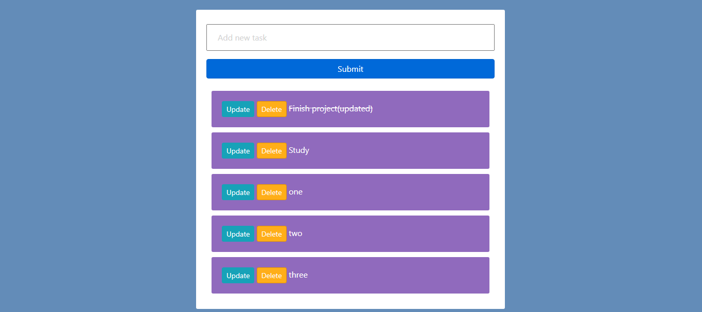

# TO Do Task Web App

First, clone the repository to your local machine:  
git clone https://github.com/faheem77/to-do-Webapp.git  
Install the requirements: 
pip install -r requirements.txt  
Apply the migrations: 

python manage.py migrate   Finally, run the development server:
python manage.py runserver  

#Deployed on the Web
Link: <a> https://todo7450.herokuapp.com </a>
